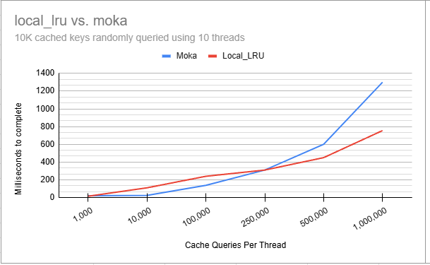

# Local LRU

local_lru is a simple, lean, fast, thread-safe and lock-free implementation of LRU (Least Recently Used) caching in Rust. 
Its speed and thread-safety is based on using thread-local storage rather than locking. 

[](https://crates.io/crates/local_lru)
[](https://docs.rs/local_lru)

Using cache based on thread-local storage is different from other caching strategies. Please read the [Quick Introduction](#quick-introduction) section to understand the differences and decide if this cache is suitable for your use case.

__** Please regularly check for updates, as the API is constantly improving and fixes are being added regularly until a version will be released.**__

## Features

- Thread-safe and lock-free
- High performance with O(1) complexity for cache operations
- Uses thread-local storage for speed and thread-safety
- Includes TTL (Time To Live) expiration
- Supports adding and retrieving structs

## Example Usage

Note that `LocalCache::initialize` only initializes the _parameters_ that set the cache's capacity and ttl. It does _not_ create the cache itself.
The cache will only be lazily created with the initalized params when a thread first accesses the cache with a call to `get_item` or `add_item`. Subsequent calls to `initialize` simply modify the cache parameters, which will only effect threads that did not previously access the cache.

```rust
use local_lru::LocalCache;  
use bytes::Bytes;
// Create a new cache with a capacity of 2 items and a TTL of 60 seconds 
let cache = LocalCache::initialize(2, 60);
// Modify the cache parameters for the current thread
let cache = LocalCache::initialize(2, 0);
// Add an item to the cache
cache.add_item("key1", Bytes::from("value1"));
// Get the item from the cache
assert_eq!(cache.get_item("key1"), Some(Bytes::from("value1")));

// Add a struct to the cache
 #[derive(Debug, Serialize, Deserialize, PartialEq, Clone)]
struct TestStruct {
    field1: String,
    field2: i32,
}
let test_struct = TestStruct {
    field1: "Hello".to_string(),
    field2: 42,
};
// Add the struct to the cache
cache.add_struct("test_key", test_struct.clone());
// Retrieve the struct from the cache
let ret_struct: Option<TestStruct> = cache.get_struct("test_key");
// Assert that the retrieved struct matches the original
assert_eq!(ret_struct, Some(test_struct.clone()));
```


## Quick Introduction

 One of the main challenges with LRU caching is that it invovles a lot of writes and updates of its internal data structures: each get and set operation in LRU cache requires updating of at least one pointer.
 This fact diminishes the famous O(1) complexity of LRU cache operations in multithreaded applications, such as web services, which require synchronization and locking mechanisms to ensure thread-safety and thus significantly harm performance.

 The thread-local strategy allows us to create a fast, thread-safe, and lock-free O(1) cache for the price of using more memory. As such, the cache is suitable for applications that require a high-performance and thread-safe cache, but do not require a large memory footprint.

Using thread-local storage means that each thread has its own cache, and the cache is not shared between threads. This means that a cache item that is added to the cache using one thread will not be accessible to other threads. Users need to be aware of this behavior and design their usage of the cache accordingly. This can be very useful for applications that cache results of database queries, for example. If your app uses 4 threads, then it will have 4 caches stores, one per thread, and for each row you will have to access the database _at most_ 4 times, once per thread. But you will gain in performance and scalability, avoiding locks and mutexes.

## Example using local_lru in an Axum service for caching

 ```rust
 struct CacheItem {
    key: String,
    value: String,
}
#[tokio::main]
async fn main() {
    let cache = Arc::new(LocalCache::initialize(100, 120));
    let app = axum::Router::new()
        .route("/get/:key", axum::routing::get(get_key))
        .route("/post", axum::routing::post(post_key))
        .with_state(cache);

    let listener = TcpListener::bind("0.0.0.0:3000").await.unwrap();
    axum::serve(listener, app).await.unwrap();
}

async fn get_key(
    State(cache): State<Arc<LocalCache>>,
    Path(key): Path<String>,
) -> (StatusCode, String) {
    if let Some(content) = cache.get_item(&key) {
        let content_str = String::from_utf8(content.to_vec()).unwrap();
        let response_str = format!(
            "{{ \"key\": \"{}\", \"value\": \"{}\" }}",
            key, content_str
        );
        (StatusCode::OK, response_str)
    } else {
        (StatusCode::NOT_FOUND, "".to_string())
    }
}
 ```

## Benchmarks

Benchmarking is a very complex task and the results can be very misleading if not done carefully. Please run your own benchmarks to see if this cache is suitable for your use case.   

I'm adding these results just to give you an idea of the cache's performance. Its hard to find cache implementations in Rust with similar properties (thread-safe, in-memory, simple, LRU) so I cannot make a direct comparison.   

I did run some benchmarks using the [moka crate](https://crates.io/crates/moka) which is a wonderful implementation of a high-performance concurrent cache.  

I created 10,000 key-value pairs, and then I measured the time it took for 10 threads to run N iterations, where each iteration consists of randomly picking a key-value pair and then either getting the value from the cache or adding the value to the cache if it doesn't exist.
I measured 1K to 1M iterations X 10 threads and plotted the results.



As shown in the results, Moka initially outperforms local_lru until around 250,000 iterations per thread. Beyond that point, local_lru becomes faster, and by the time iterations reach 1 million per thread (totaling 10 million), local_lru is nearly twice as fast as Moka. This suggests that avoiding locking mechanisms can significantly boost throughput in high-throughput, multi-threaded scenarios despit the use of thread-local storage which causes many cache misses. 
